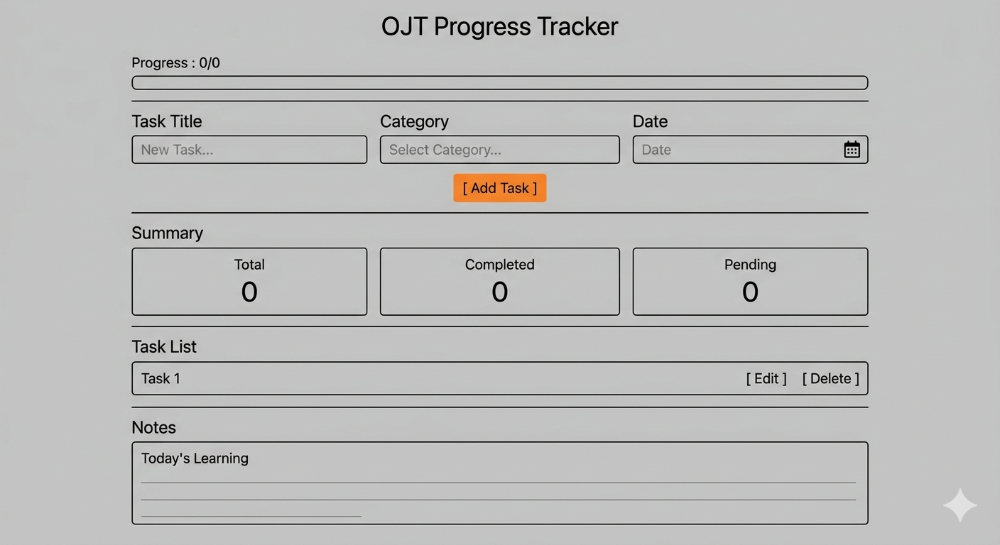

# OJT-Progress-Tracker
Mini Productivity App for tracking daily OJT tasks, progress and learning notes.

# Project Goal

Build a simple productivity application to manage:
- Daily OJT Tasks
- Progress Tracking
- Learning Notes

# Daily Progress

## Day 1 — Setup

### Completed
- Created project structure
- Initialized Git
- Connected HTML
- Connected CSS
- Connected JavaScript
- First Commit

### Evidence
Add screenshots in:
assets/Screenshots/

Files:
- [!vscode](assets/Screenshots/Day1-vscode.png)
- [!vscode](assets\Screenshots\Day2-Github.png) 

### Status
Completed

## Day 2 — Planning

### Goal
Plan the OJT Progress Tracker before coding.

### Requirements
- Add Task
- Edit Task
- Delete Task
- Mark Complete
- Category
- Date
- Notes
- Summary
- Local Storage

### Wireframe

### Status
Completed