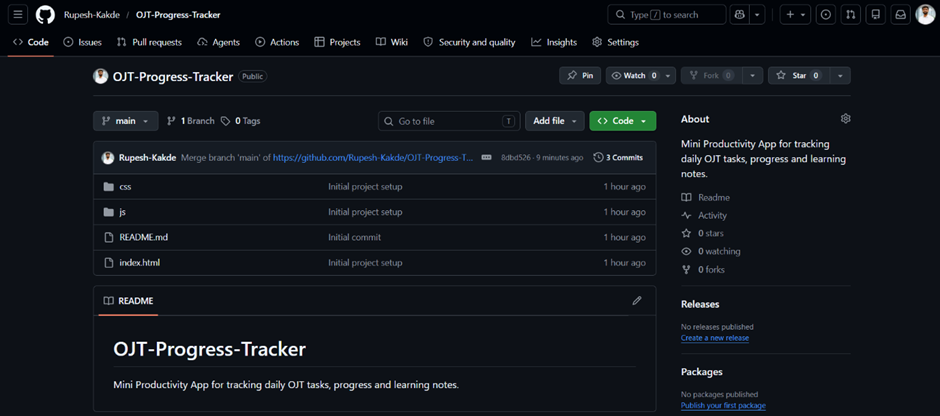
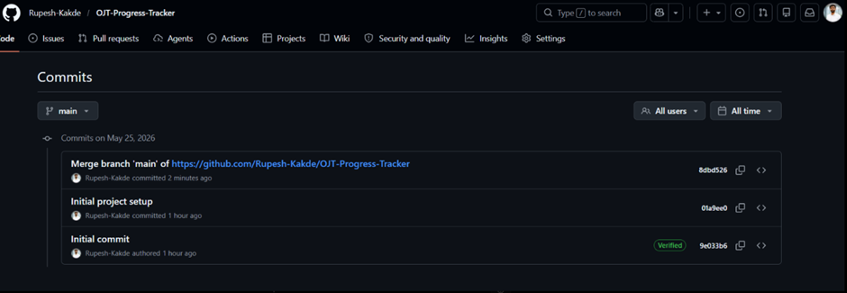
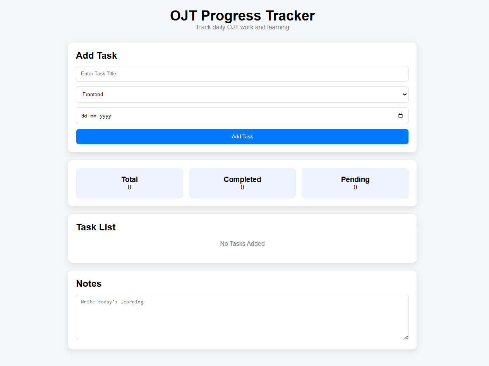
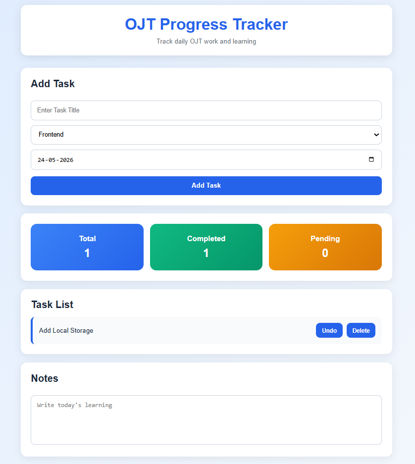
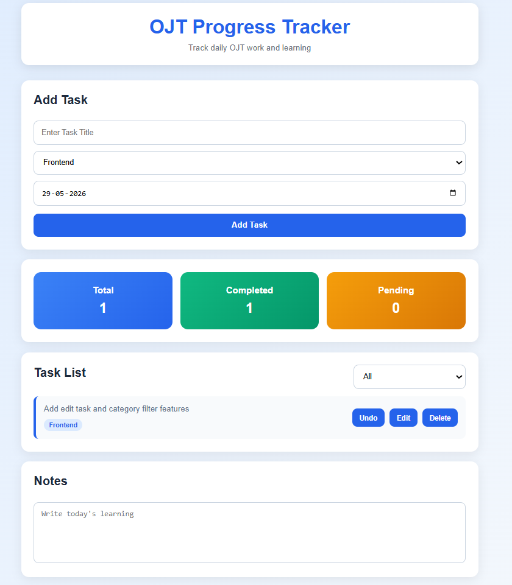
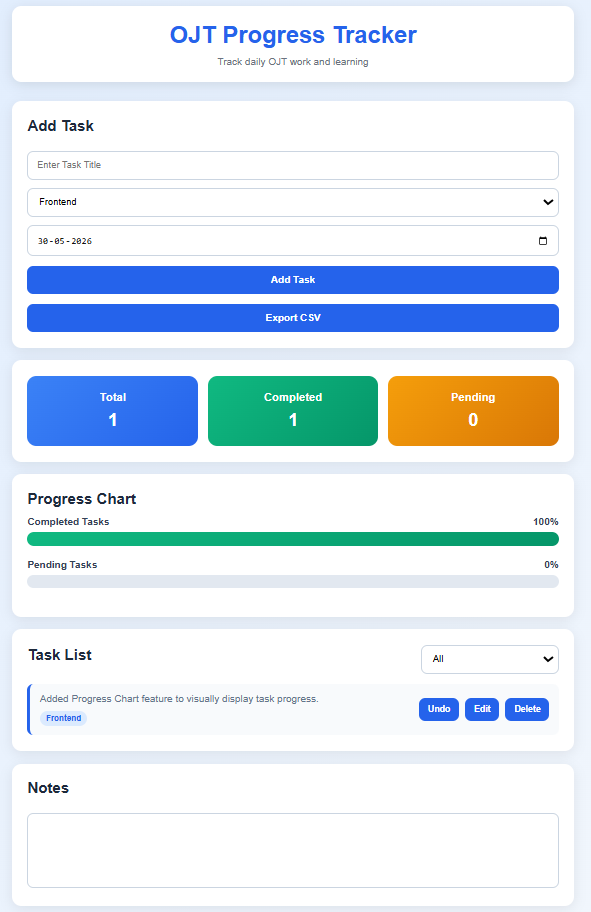
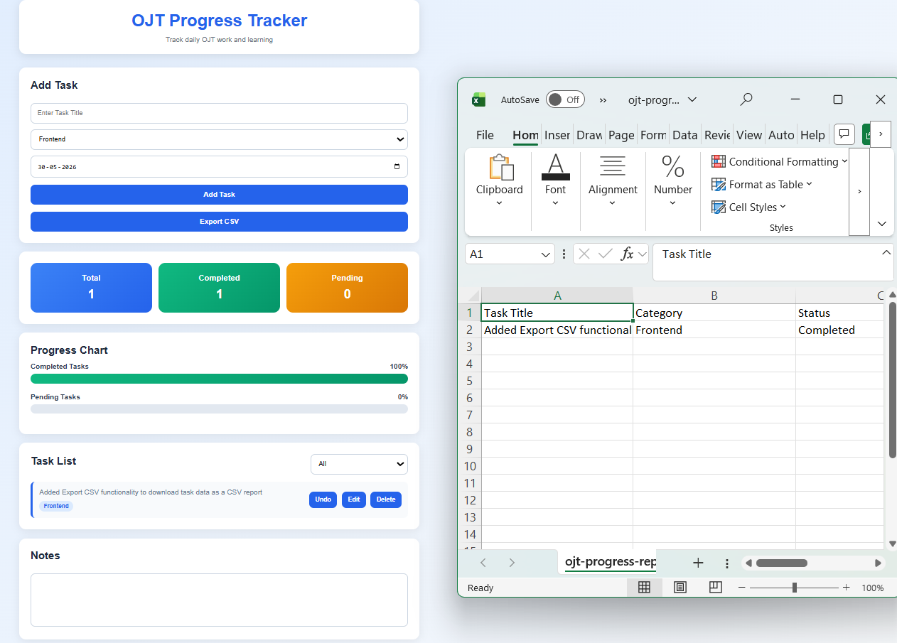

# OJT-Progress-Tracker
Mini Productivity App for tracking daily OJT tasks, progress and learning notes.

# Project Goal

Build a simple productivity application to manage:
- Daily OJT Tasks
- Progress Tracking
- Learning Notes

# Daily Progress

## Day 1 — Setup

### Completed
- Created project structure
- Initialized Git
- Connected HTML
- Connected CSS
- Connected JavaScript
- First Commit

### Evidence
Add screenshots in:
assets/Screenshots/

### Image:

### Status
Completed

## Day 2 — Planning

### Goal
Plan the OJT Progress Tracker before coding.

### Requirements
- Add Task
- Edit Task
- Delete Task
- Mark Complete
- Category
- Date
- Notes
- Summary
- Local Storage

### Wireframe

### Status
Completed

## Day 3 — UI Build

### Completed

- HTML Layout
- CSS Styling
- Responsive Structure
- Static Page Created

### Evidence

## Day 4 — JavaScript Logic

### Completed

- Add Task
- Delete Task
- Mark Complete
- Dynamic Summary
- Local Storage

### Evidence

## Day 5 — Feature Enhancements

### Completed

- Added Edit Task functionality
- Added Category Filter feature
- Improved task management experience
- Verified Local Storage compatibility with new features
- Tested all existing functionality after enhancements

### Evidence

## Day 6 — Progress Tracking and Data Export Enhancements

### Completed

- Added Progress Chart feature to visually display task progress.
- Added Export CSV functionality to download task data as a CSV report.

### Evidence

